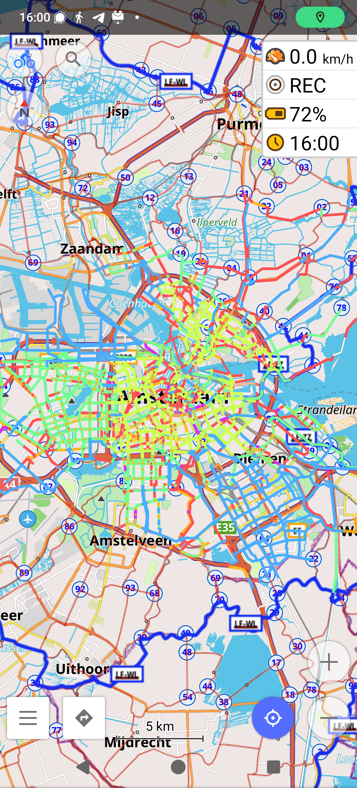
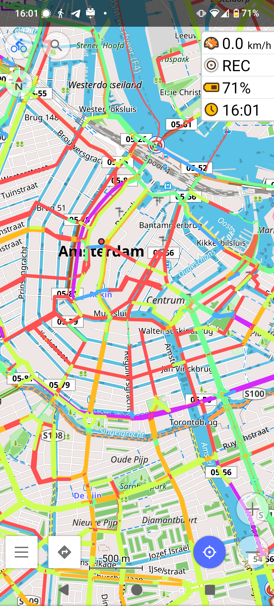
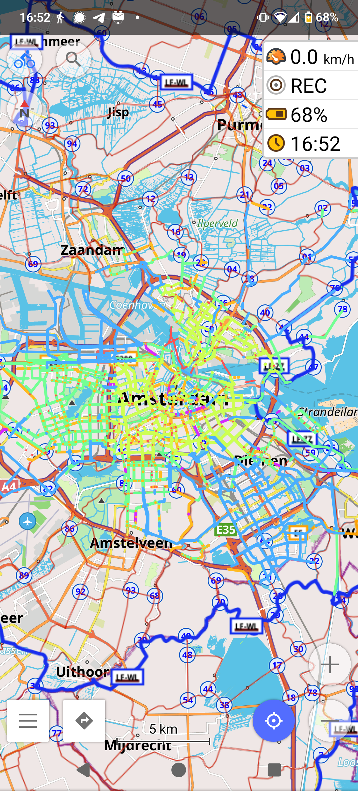
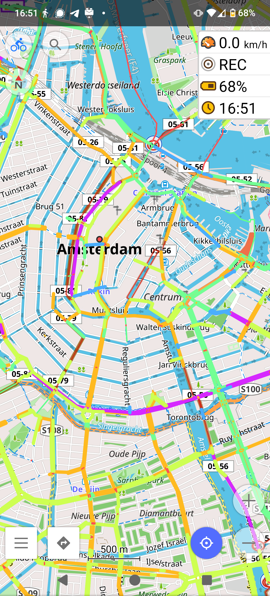
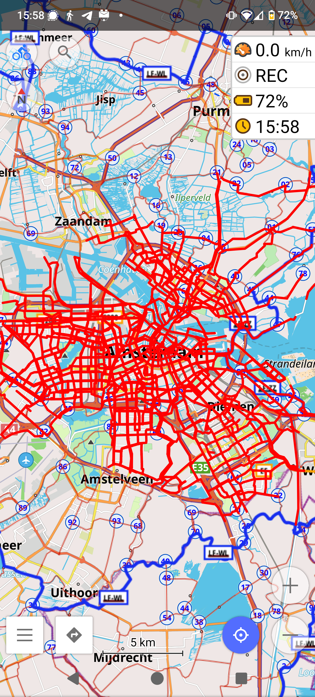
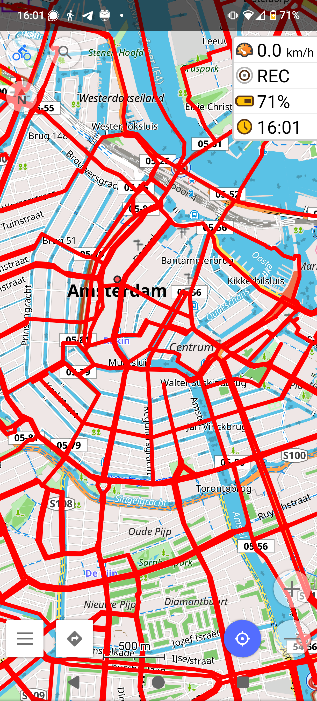
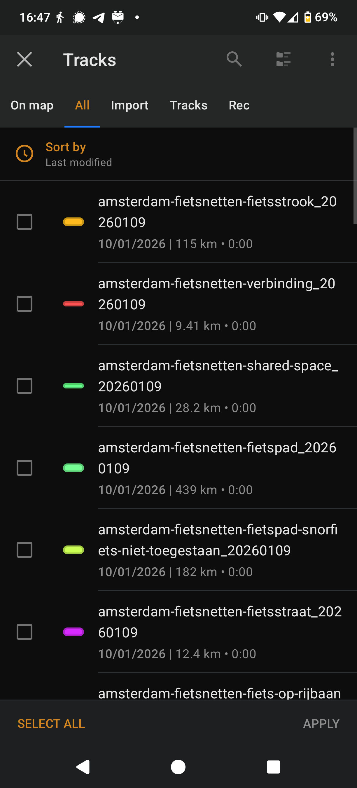

# Amsterdam Cycling Network (fietsnetten) for OsmAnd

This repository contains code to generate up-to-date OsmAnd GPX routes of the
Amsterdam (NL) cycling network ([fiets hoofd- & plusnet](https://fietsersbond.amsterdam/dossiers/het-hoofdnet-fiets/)).

In a nutshell, the hoofd- & plusnet cycling network provide safe
and pleasant routes for navigating your way through the city of Amsterdam by
bike.

## Motivation

Currently, the Municipality of Amsterdam offers a detailed [Leaflet map](https://maps.amsterdam.nl/fietsnetten/)
for viewing these cycling routes. In my opinion however, using the map on the
run (or more precisely, during the ride) is quite awkward. I was therefore looking
for a way to include the cycling routes in my favorite Navigation App, [OsmAnd](https://osmand.net/).

## Usage

### Download the GPX files

Download the GPX files from the [latest release](https://github.com/Jasper-Ben/Amsterdam-Fietsnetten-OsmAnd/releases/latest)
onto your phone based on your needs.

I currently release multiple GPX files, based on the type of bicycle route:

1. Fietspad (separated bicycle path)
2. Fietspad - snorfiets niet toegestaan (separated bicycle path, mopeds not allowed)
3. Fietspad - onverplicht (optional bicycle path)
4. Brom-/Fietspad (combined moped and bicycle path)
5. Fietsstrook (bicycle lane)
6. Fietsstraat (bicycle street)
7. Fiets op rijbaan (bicycles on the roadway)
8. Shared-space
9. Fietsoversteek (bicycle crossing)
10. Verbinding (connection, e.g. ferry)

The separate files offer the advantage that they are color-coded
(similar to the color coding on the Leaflet map) and allow for granular control
over the type of bicycle infrastructure you want to use at any given time.
Out on a ride with your young children and don't want to ride on the roadway?
Simply deactivate the "Fiets op rijbaan" routes and you are good to go!

Alternatively, I also offer a combined GPX file (gecombineerd), which combines
all routes mentioned above into a single GPX file. However, this lacks the
aforementioned features of the separate GPX files.

### Import GPX files in OsmAnd

Please follow the [official OsmAnd documentation for importing tracks](https://www.osmand.net/docs/user/personal/tracks/manage-tracks/#import).

## Map sources and Terms of Service

The generated GPX files are based on MapInfo files kindly provided by the
Municipality of Amsterdam and is available to anyone free of charge when used
in accordance to their terms of service.

More details can be found in [TERMS_OF_SERVICE.md](./TERMS_OF_SERVICE.md).

**This project is an independent work and is not affiliated with or endorsed by
the Municipality of Amsterdam.**

## Map Updates and Release Mechanism

A Github action is used to automatically check for changes to the map data on
a daily basis. If a change to one of the files is detected (via checksums), a
new release is automatically created. The releases are versioned based on the
date of the release (formatted YYYYMMDD).

In addition to the generated GPX files, each release also contains the source
MapInfo files (_.mid and _.mif).

## Building the GPX files yourself

The easiest way to build the GPX files yourself is by using our provided nix
development environment and Makefile. This should work on Linux,
Windows (via WSLv2) and MacOS and ensures that all required software is
available on your system.

Install a nix package manager (I recommend [lix](https://lix.systems/install/))
and make sure you have flake support enabled.

## Screenshots

### Separate GPX files

#### All separate GPX files active (zoomed out)

#### All separate GPX files active (zoomed in)

#### Separate GPX files without cycling on the road (zoomed out)

#### Separate GPX files without cycling on the road (zoomed in)

### Combined GPX file (gecombineerd)

#### Combined GPX file (zoomed out)

#### Combined GPX file (zoomed in)

### Track selection

